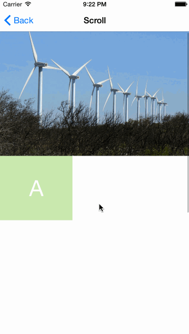
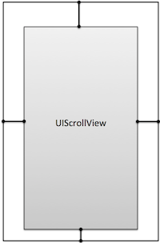
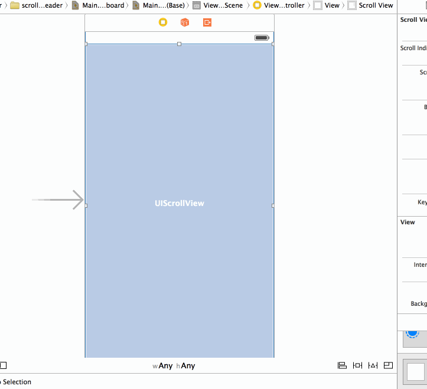
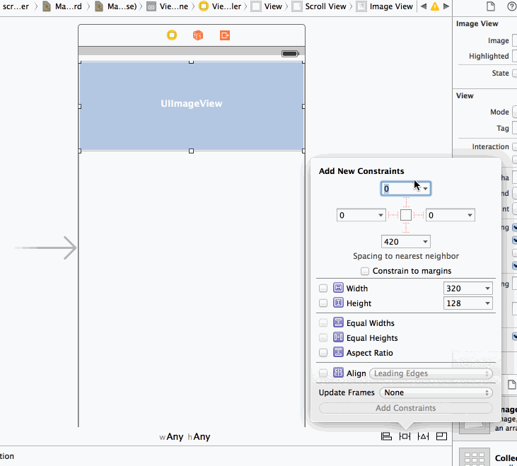
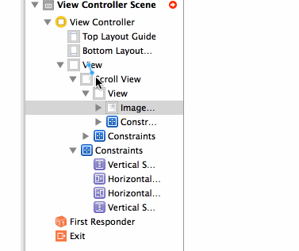
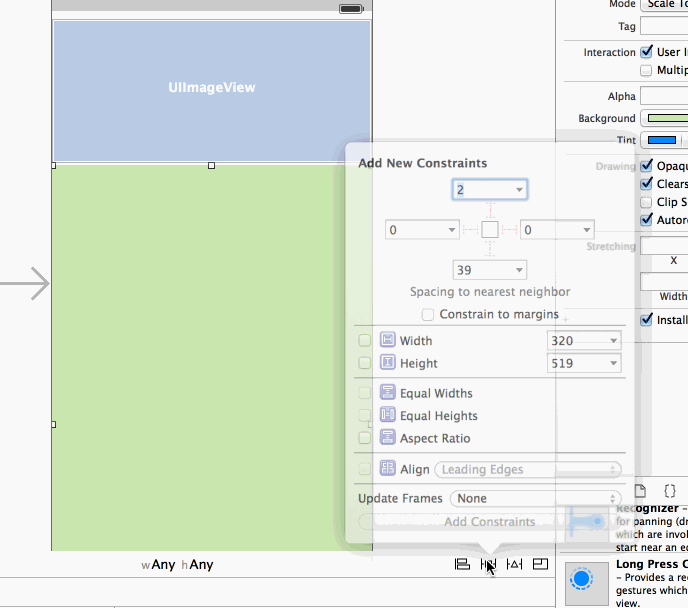
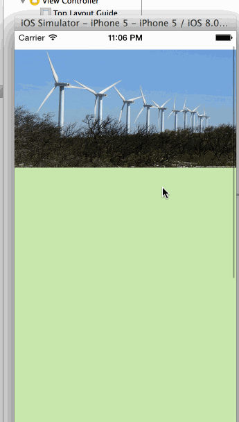
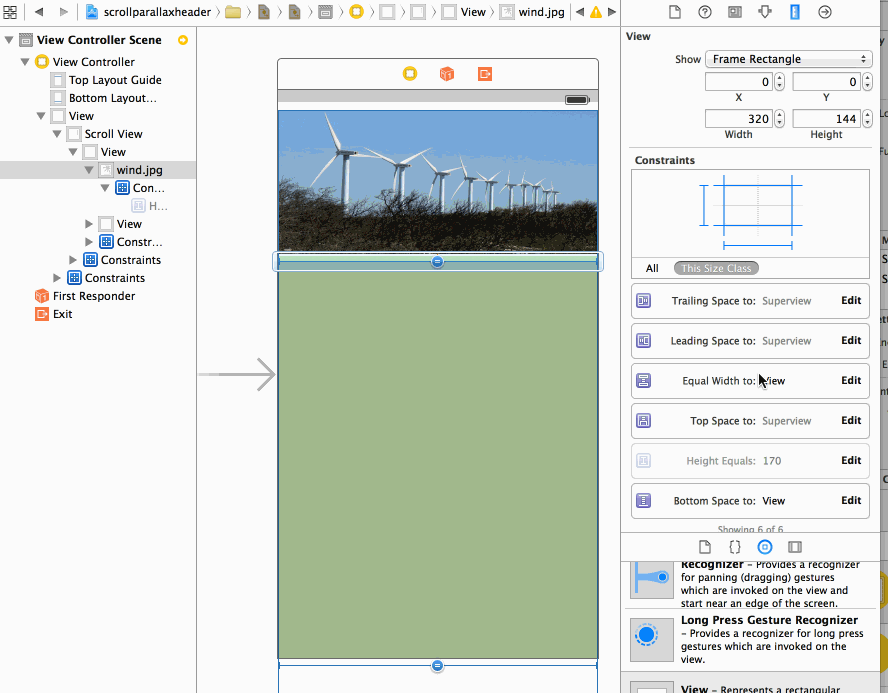
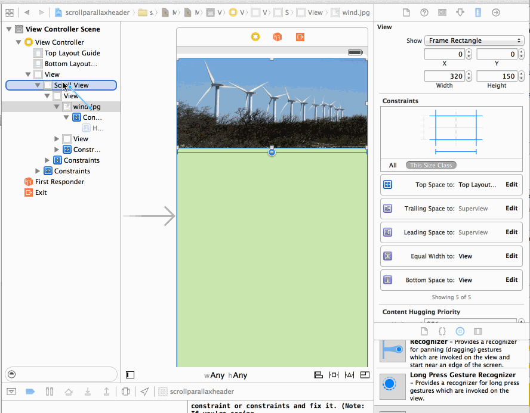

Scrollview Parallax/Zoom/Stretch
================

Creating parallax effect on UIScrollView only using Auto Layout.
This sample project is just an illustration of the article written by Pete Hare, that you can find here:

[PETE SHARE's post on domesticcat.com](http://blog.domesticcat.com.au/ios/2014/03/19/creating-parallax-effect-on-uiscrollview-using-simple-constraints/)

I saw in the comment that some people were asking for the code, so i think i could share this.

I tried to do it first by only using IB (Interface Builder), i rarely use IB, i usually do these things programmatically.
And i must say that i am really not confortable with it, i had to restart from scratch several times. That's why i decided to also do the same thing with code, you might have a look, i think it makes it more clear.
In the rest of the document i might also use visual format when i find it more easy to understand than screenshots of the IB.

## Step by Step notes

There are some key points that you need to understand if you want to try to do this.
I'd recommand you to first start by setting up the scrollview with the image view in top of the scrollcontent.
Once you have this working you can start to setup the cool effect.

### Step 1 : Add the UIScrollview 

Add 4 constraints between the scrollview and the parent view in order to make it full screen.
In my sample i am using the top layout guide to pin the view, but if you want something full screen (or transparency effect under navbar) you can attach to the top of the parent view.

 

### Step 2 : Add the Content View

In this sample i am using a single child view to put all the scrollable content (notice that you can do differently).

Here we are doing something very not intuitive for the content constraint.
In order to make the scroll work you must put also four '0' space constraints (top, bottom, left, right) between the scroll content and the scrollview.

### Step 3 : Setup the content

Now let's add the imageView as a child of the content view.

Let's set the constraints on the image view, we add again 4 constraints to the image, 0 top, 0 left, 0 right, and let's put the height to some arbritary size (150).

At this point you should have a lot of warning in IB, we will fix it later.
If you run you should see nothing, simply because a zero size view will respect all your constraint.

So let's now set the content size.
In the article Pete is giving a nice tip to set the width. We can just say that the width of the image should be equal to the with of the main controller view width (that is full screen :)
In order to do that, you have to Control-drag from the main view to the imageview in the Interface Builder outline view.

Let's set the content height.
You have now to add any additional views to the content.
And As stated in apple doc:
> You must make sure you create constraints for all the subviews inside a scroll view. For example, when defining the > constraints for a view that doesn’t have an intrinsic content size, you’ll need more than just a leading edge 
> constraint—you must also create trailing edge, width, and height constraints. 

> *There cannot be any missing constraints, starting from one edge of the scroll view to the other.*

In visual format, it could be expressed like that:

    V:|-0-[imageView(150)]-0-[subContentView(700)]-0-|
    
    |-0-[topImageView(==super)]-0-|

    |-0-[subContentView]-0-|

If your subviews have intrinsic height, you can remove the height constraint.

If you run now, you should have classic scrolling

### Step 4 : Do the magic

Ok here is the interesting part.
What we want to do is to remove the top constraint of the image view to the parent view (scrollcontent view), and instead attach to the topGuide:

    V:|-0-[imageView(150)]..   --- replaced By -->   V:[topGuide]-0-[imageView(150)]..

But by doing this we are violating the scroll content rule:

> *There cannot be any missing constraints, starting from one edge of the scroll view to the other.*

Because there is no more constraint starting from the top of the content view going to one of the subview (we broke the one going to the imageView).

So as explained by Pete Hare in the article, we have to replace this missing constraint with a new one:

    V:|-0-[imageView(150)]-0-[subContentView(700)]-0-| --- replaced By --> @"V:|-150-[subContentView(700)]-0-|"

You can find here an animated gif capture of this step, i don't know if it's really helpfull :), please let me know if you find it usefull

If you try to run now, you will already have the cool effect.
But if you try to scroll down, at some point you will have an exception in the console:

     Unable to simultaneously satisfy constraints.

THis is simply because at some point, when the bottom of the imageView reach the top of the screen, the top constraint to the topGuide cannot be satisfied, it would mean that the imageHeight is negative.

The solution is to add an additional constraint to the top layout guide:
   
    V:[topGuide]-<=0-[imageView]

    in addition to

    V:[topGuide]-0-[imageView]

And as we want the image top to stick as long as possible to the top of the screen, but to break when necessary, we just need to lower the priority:

    V:[topGuide]-=0@750-[imageView]

(The default priority is 1000)

## Misc

If you have some issues with the scroll bar not going to the top (leaving a small gap), you may have to disable the 'Adjust Scroll View Insets' in the property view of the ViewController. 

